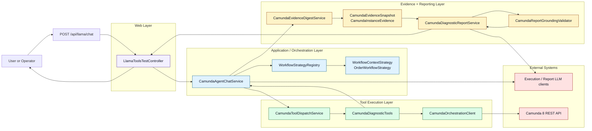
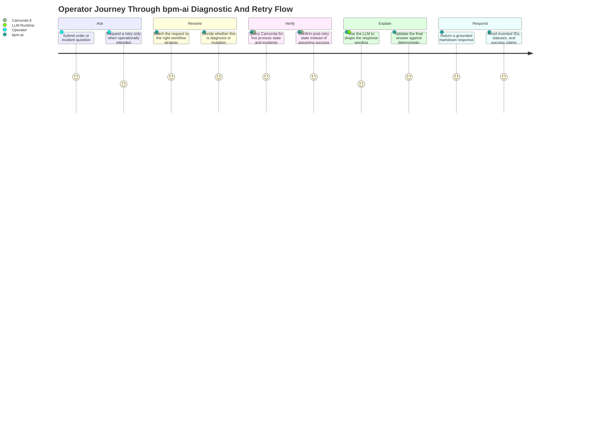
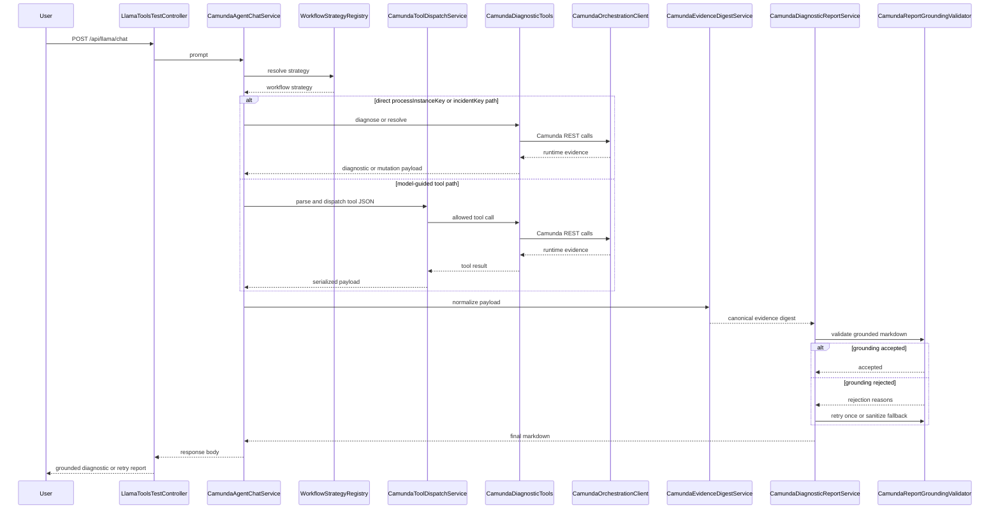

# Camunda Chat Agent Architecture

## Objective

This module implements a local diagnostic agent for Camunda 8 workflows. The agent receives a user prompt, resolves workflow context, executes Camunda-backed tools, collects runtime evidence, and returns a grounded markdown report. The design constraint is strict: the final answer must not invent process data outside the Camunda orchestration APIs and static workflow context.

## Design Principles

- Single Responsibility: each class owns one concern.
- Open/Closed: workflow-specific behavior is extended through `WorkflowContextStrategy`, not by changing the controller flow.
- Liskov Substitution: strategy implementations are interchangeable through the shared interface.
- Interface Segregation: evidence extraction, tool dispatch, orchestration, reporting, and validation are split so callers depend only on what they use.
- Dependency Inversion: the controller depends on an application service, and orchestration depends on injected collaborators rather than embedding implementation logic.

## Visual Architecture

### Operator Journey View

This journey view explains the same architecture from the operator's perspective. It is useful when the audience cares more about the user experience and trust model than about container boundaries.

Journey highlights:

- The operator starts with a natural-language question, not a low-level API command.
- `bpm-ai` resolves workflow context before it tries to interpret runtime state.
- Camunda remains the source of truth for diagnosis and retry verification.
- The LLM helps present the answer, but the final response is still grounded and validated before it is returned.

## Diagnostic And Retry Flow

## Current Class Structure

### Web Layer

- `src/main/java/com/shubham/dev/bpm_agent/chat/LlamaToolsTestController.java`
  - Thin HTTP adapter.
  - Validates the incoming request body.
  - Delegates prompt handling to `CamundaAgentChatService`.
  - Returns plain-text markdown to the caller.

### Application Service Layer

- `src/main/java/com/shubham/dev/bpm_agent/chat/service/CamundaAgentChatService.java`
  - Main session orchestrator.
  - Resolves workflow strategy from prompt text.
  - Builds the execution-model system prompt.
  - Runs the tool-calling loop.
  - Detects direct `processInstanceKey` and `incidentKey` requests.
  - Applies explicit retry-intent gating for mutation tools.
  - Short-circuits into final report generation once deep diagnostics are available.
  - Routes retry outcomes through the report service so mutation responses are returned as grounded markdown instead of raw JSON.

### Tool Execution Layer

- `src/main/java/com/shubham/dev/bpm_agent/chat/service/CamundaToolDispatchService.java`
  - Extracts tool JSON from model output.
  - Resolves the requested tool name.
  - Dispatches the tool call to `CamundaDiagnosticTools`.
  - Serializes tool results for reuse by orchestration.

- `src/main/java/com/shubham/dev/bpm_agent/chat/CamundaDiagnosticTools.java`
  - Spring AI tool surface over Camunda REST-backed diagnostics.
  - Exposes:
    - `searchProcessInstances`
    - `fetchVariablesForInstance`
    - `diagnoseProcessInstance`
    - `resolveIncidentByKey`
    - `resolveIncidentsByProcessInstance`
  - Verifies post-resolution incident state before declaring success for mutation operations.

- `src/main/java/com/shubham/dev/bpm_agent/camunda/CamundaOrchestrationClient.java`
  - Encapsulates Camunda 8 REST calls.
  - Executes dynamic search, diagnostic, and mutation queries against the local cluster.

### Evidence Layer

- `src/main/java/com/shubham/dev/bpm_agent/chat/service/CamundaEvidenceDigestService.java`
  - Converts raw diagnostic JSON into a canonical evidence snapshot.
  - Builds a digest that is easier for the report model to reason over than nested raw JSON.
  - Normalizes both diagnostic payloads and incident-resolution payloads.
  - Keeps normalization deterministic and avoids inferring runtime state from mutation results.
  - Extracts:
    - allowed numeric identifiers
    - allowed process-like identifiers
    - per-instance evidence records

- `src/main/java/com/shubham/dev/bpm_agent/chat/model/CamundaEvidenceSnapshot.java`
  - Immutable normalized evidence bundle used by reporting and validation.

- `src/main/java/com/shubham/dev/bpm_agent/chat/model/CamundaInstanceEvidence.java`
  - Minimal per-instance evidence for semantic grounding checks.
  - For incident-resolution payloads, tracks only currently remaining incidents as active evidence.

### Reporting Layer

- `src/main/java/com/shubham/dev/bpm_agent/chat/service/CamundaDiagnosticReportService.java`
  - Creates the report-only model client.
  - Uses the canonical evidence digest instead of raw nested payload as the primary reporting context.
  - Enforces markdown-only final output.
  - Retries once after grounding rejection.
  - Falls back to sanitization if the model still leaks unsupported identifiers or contradictions.

### Validation Layer

- `src/main/java/com/shubham/dev/bpm_agent/chat/validation/CamundaReportGroundingValidator.java`
  - Verifies the final report against evidence.
  - Rejects:
    - unsupported instance keys
    - unsupported process-like identifiers
    - contradictory state claims
    - incorrect incident summaries
    - leaked tool-call JSON
    - leaked mutation-tool JSON
  - Sanitizes unsupported identifiers in fallback mode.

## End-to-End Flow

1. User sends `POST /api/llama/chat`.
2. `LlamaToolsTestController` validates the request and forwards the prompt to `CamundaAgentChatService`.
3. `CamundaAgentChatService` resolves a `WorkflowContextStrategy` from `WorkflowStrategyRegistry`.
4. If the prompt already contains a direct `processInstanceKey`, the agent bypasses search:
   - for diagnosis prompts, it calls `diagnoseProcessInstance`
   - for explicit retry prompts, it calls `resolveIncidentsByProcessInstance`
5. If the prompt contains a direct `incidentKey` together with explicit retry intent, the agent calls `resolveIncidentByKey`.
6. Otherwise the execution model is prompted to emit one of the allowed tool JSON blocks.
7. `CamundaToolDispatchService` parses and dispatches the tool call.
8. If a process search returns an active instance, the agent deterministically escalates:
   - to `diagnoseProcessInstance` for read-only diagnostic prompts
   - to `resolveIncidentsByProcessInstance` for explicit retry prompts
9. Once a diagnostic or mutation payload is available, `CamundaDiagnosticReportService` builds a canonical evidence digest using `CamundaEvidenceDigestService`.
10. The report model generates markdown from the digest.
11. `CamundaReportGroundingValidator` validates the report against the evidence snapshot.
12. If grounding fails, the report service retries once with explicit rejection reasons.
13. If grounding still fails, the report is sanitized and returned.

## Why This Structure Is Better Than the Original Controller

The original `LlamaToolsTestController` mixed six concerns:

- HTTP request handling
- workflow strategy resolution
- model prompt construction
- tool JSON parsing and execution
- evidence transformation
- report generation and grounding

That made the class large, fragile, and difficult to test. The current structure reduces coupling and gives each class a single reason to change:

- tool protocol changes affect `CamundaToolDispatchService`
- evidence shape changes affect `CamundaEvidenceDigestService`
- grounding policy changes affect `CamundaReportGroundingValidator`
- reporting prompt changes affect `CamundaDiagnosticReportService`
- session-flow changes affect `CamundaAgentChatService`

## Constraints and Guardrails

- The final response is agent-generated, not Java-template-generated.
- The final response must remain grounded to Camunda evidence.
- The report path uses a report-only chat client and must never emit tool JSON.
- Mutation operations remain explicit and retry-intent-gated.
- Mutation command acceptance is not treated as operational success; post-resolution verification determines final retry outcome.
- The evidence layer must normalize structure only; it must not infer process runtime state from incident-resolution results.

## Testing Coverage Added

- `src/test/java/com/shubham/dev/bpm_agent/chat/service/CamundaEvidenceDigestServiceTest.java`
  - Verifies digest extraction across root and child process diagnostics.
  - Verifies incident-resolution payload normalization without inferred runtime state.

- `src/test/java/com/shubham/dev/bpm_agent/chat/CamundaDiagnosticToolsTest.java`
  - Verifies process-instance incident resolution fails when incidents remain after verification.
  - Verifies process-instance incident resolution succeeds only when no active incidents remain.

- `src/test/java/com/shubham/dev/bpm_agent/chat/service/CamundaAgentChatServiceTest.java`
  - Verifies retry-intent prompts with bare long keys route deterministically.
  - Verifies `searchProcessInstances` + explicit retry intent escalates to process-instance incident resolution.

- `src/test/java/com/shubham/dev/bpm_agent/chat/validation/CamundaReportGroundingValidatorTest.java`
  - Verifies incident contradiction rejection.
  - Verifies unsupported identifier sanitization.

## Next Refactor Candidate

The main remaining class with meaningful orchestration complexity is `CamundaAgentChatService`. If further cleanup is needed, split it into:

- a session coordinator for the loop and short-circuit policy
- a prompt builder for execution-model prompts

That would reduce prompt policy churn inside the orchestration service while keeping the current behavior intact.
