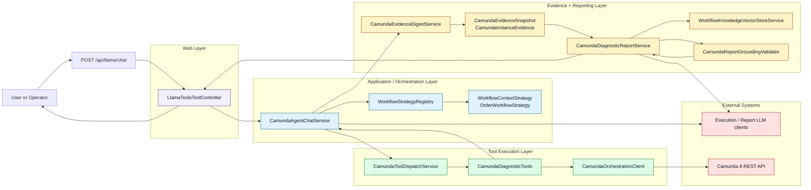
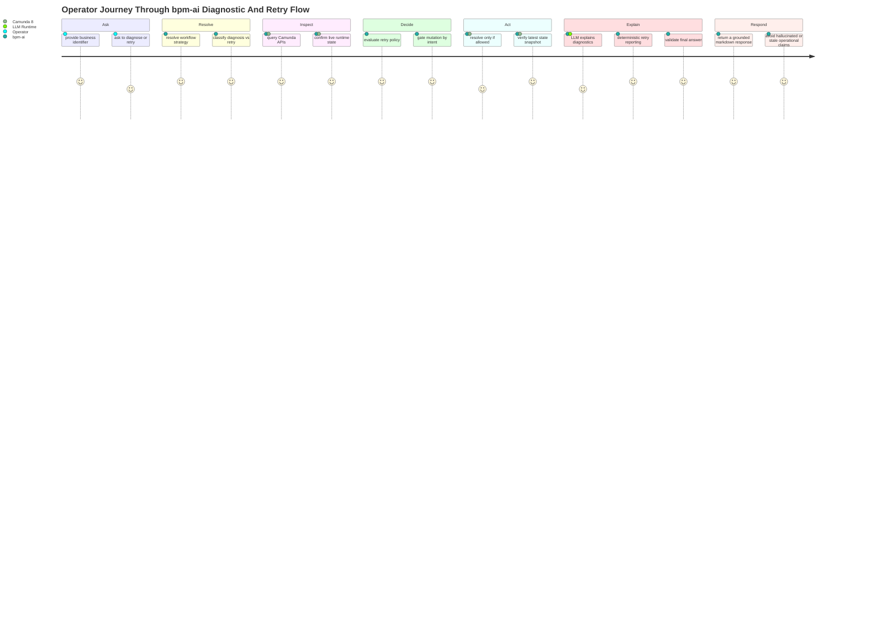
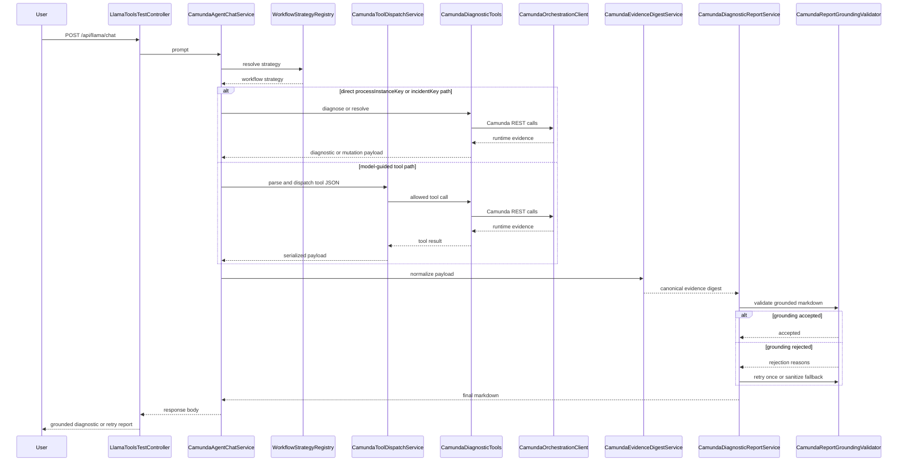

# Camunda Chat Agent Architecture

## Objective

This module implements a local diagnostic agent for Camunda 8 workflows. The agent receives a user prompt, resolves workflow context, executes Camunda-backed tools, collects runtime evidence, and returns a grounded markdown report. The design constraint is strict: the final answer must not invent process data outside the Camunda orchestration APIs and static workflow context.

## Design Principles

- Single Responsibility: each class owns one concern.
- Open/Closed: workflow-specific behavior is extended through `WorkflowContextStrategy`, not by changing the controller flow.
- Liskov Substitution: strategy implementations are interchangeable through the shared interface.
- Interface Segregation: evidence extraction, tool dispatch, orchestration, reporting, and validation are split so callers depend only on what they use.
- Dependency Inversion: the controller depends on an application service, and orchestration depends on injected collaborators rather than embedding implementation logic.

## Visual Architecture

### Operator Journey View

This journey view explains the same architecture from the operator's perspective. It is useful when the audience cares more about the user experience and trust model than about container boundaries.

Journey highlights:

- The operator starts with a natural-language question, not a low-level API command.
- `bpm-ai` resolves workflow context before it tries to interpret runtime state.
- Camunda remains the source of truth for diagnosis, retry execution, and post-mutation verification.
- Retry actions are gated by explicit intent and workflow policy before any mutation is sent.
- Read-only diagnostics can use LLM-assisted explanation, but retry outcomes are reported from the latest verified state snapshot.

## Diagnostic And Retry Flow

## Current Class Structure

### Web Layer

- `src/main/java/com/shubham/dev/bpm_agent/chat/LlamaToolsTestController.java`
  - Thin HTTP adapter.
  - Validates the incoming request body.
  - Delegates prompt handling to `CamundaAgentChatService`.
  - Returns plain-text markdown to the caller.

- `src/main/java/com/shubham/dev/bpm_agent/strategy/admin/IncidentResolutionRuleAdminController.java`
  - Thin JSON admin adapter for the persisted incident-rule catalog.
  - Exposes list, metadata, create, update, enable/disable, and delete operations for consultant-managed rule editing.
  - Accepts BPMN file uploads and returns advisory rule drafts generated from BPMN parsing plus bounded LLM assistance.
  - Keeps rule validation and normalization in a dedicated service instead of embedding persistence logic in the controller.

### Application Service Layer

- `src/main/java/com/shubham/dev/bpm_agent/chat/service/CamundaAgentChatService.java`
  - Main session orchestrator.
  - Resolves workflow strategy from prompt text.
  - Builds the execution-model system prompt.
  - Runs the tool-calling loop.
  - Detects direct `processInstanceKey` and `incidentKey` requests.
  - Applies explicit retry-intent gating for mutation tools.
  - Uses workflow strategy policy to evaluate both single-order and bulk-order retry requests before mutation dispatch.
  - Supports a deterministic bulk retry path for multiple `orderId` values in one prompt under the order workflow.
  - Short-circuits into final report generation once deep diagnostics are available.
  - Routes retry outcomes through the report service so mutation responses are returned as grounded markdown instead of raw JSON.

### Tool Execution Layer

- `src/main/java/com/shubham/dev/bpm_agent/chat/service/CamundaToolDispatchService.java`
  - Extracts tool JSON from model output.
  - Resolves the requested tool name.
  - Dispatches the tool call to `CamundaDiagnosticTools`.
  - Serializes tool results for reuse by orchestration.

- `src/main/java/com/shubham/dev/bpm_agent/chat/CamundaDiagnosticTools.java`
  - Spring AI tool surface over Camunda REST-backed diagnostics.
  - Exposes:
    - `searchProcessInstances`
    - `fetchVariablesForInstance`
    - `diagnoseProcessInstance`
    - `resolveIncidentByKey`
    - `resolveIncidentsByProcessInstance`
  - Verifies post-resolution incident state before declaring success for mutation operations.
  - For process-instance resolution, traverses the parent/child process tree so child workflow incidents are included in both the resolution attempt and verification pass.

- `src/main/java/com/shubham/dev/bpm_agent/camunda/CamundaOrchestrationClient.java`
  - Encapsulates Camunda 8 REST calls.
  - Executes dynamic search, diagnostic, and mutation queries against the local cluster.

### Evidence Layer

- `src/main/java/com/shubham/dev/bpm_agent/chat/service/CamundaEvidenceDigestService.java`
  - Converts raw diagnostic JSON into a canonical evidence snapshot.
  - Builds a digest that is easier for the report model to reason over than nested raw JSON.
  - Normalizes both diagnostic payloads and incident-resolution payloads.
  - Keeps normalization deterministic and avoids inferring runtime state from mutation results.
  - Explicitly distinguishes direct root incident counts from full process-tree incident counts for read-only reporting.
  - Extracts:
    - allowed numeric identifiers
    - allowed process-like identifiers
    - per-instance evidence records

- `src/main/java/com/shubham/dev/bpm_agent/chat/model/CamundaEvidenceSnapshot.java`
  - Immutable normalized evidence bundle used by reporting and validation.

- `src/main/java/com/shubham/dev/bpm_agent/chat/model/CamundaInstanceEvidence.java`
  - Minimal per-instance evidence for semantic grounding checks.
  - For incident-resolution payloads, tracks only currently remaining incidents as active evidence.

- `src/main/java/com/shubham/dev/bpm_agent/chat/model/incident/*`
  - Explicit workflow-policy models for incident resolution.
  - Defines resolution context, decision, preferred resolution mode, and ordered rule matching without moving evidence normalization into the LLM.

- `src/main/java/com/shubham/dev/bpm_agent/strategy/persistence/*`
  - Persistence layer for workflow incident-resolution rules.
  - Supports UI-managed policy data through a Flyway-managed relational schema instead of requiring Java code changes for every rule edit.
  - `IncidentResolutionRuleManagementService` normalizes admin input before it is stored so strategy evaluation stays deterministic.

- `src/main/resources/static/admin/incident-rules/index.html`
  - Minimal local admin UI for business consultants and operators.
  - Uses the admin JSON endpoints directly and does not introduce a separate frontend build pipeline.
  - Supports BPMN parent/subprocess upload so candidate incident rules can be drafted before a consultant saves them.

- `src/main/java/com/shubham/dev/bpm_agent/camunda/mock/*`
  - Local mock HTTP endpoints and a worker-facing client for reproducible connector failures.
  - Supports transient HTTP 500 scenarios and non-retryable HTTP 400 scenarios for worker testing.

### Reporting Layer

- `src/main/java/com/shubham/dev/bpm_agent/chat/service/CamundaDiagnosticReportService.java`
  - Deterministically renders incident-resolution payloads directly from Camunda JSON so verified child-process and flow-element evidence cannot be dropped by report-model retries.
  - Creates the report-only model client for read-only diagnostic payloads.
  - Uses the canonical evidence digest instead of raw nested payload as the primary reporting context.
  - Pulls top-K workflow knowledge snippets from the local vector store for read-only reporting so the LLM gets BPMN and consultant-rule context without being allowed to invent live runtime state.
  - Shapes read-only report headers by prompt intent so waiting-point and workflow-path questions can produce focused top sections without weakening grounded evidence sections.
  - Enforces markdown-only final output.
  - Retries once after grounding rejection.
  - Falls back to sanitization if the model still leaks unsupported identifiers or contradictions.

- `src/main/java/com/shubham/dev/bpm_agent/strategy/retrieval/WorkflowKnowledgeVectorStoreService.java`
  - Uses one production retrieval contract backed by the injected workflow knowledge `VectorStore`, registered workflow strategies, and persisted consultant-managed rules.
  - Builds retrievable workflow documents for strategy context, persisted rules, and structured BPMN knowledge chunks.
  - Indexes one normalized retrieval document per persisted incident rule so read-only explanation can retrieve workflow scope, match conditions, and resolution metadata explicitly.
  - Rebuilds the retrieval corpus explicitly at startup and refreshes it after rule CRUD operations.
  - Uses replace-and-rebuild refresh semantics so the stored workflow knowledge remains deterministic and idempotent across updates.
  - Supplies similarity-searched workflow context only for LLM explanation, not for live runtime evidence.

- `src/main/java/com/shubham/dev/bpm_agent/strategy/retrieval/BpmnKnowledgeExtractor.java`
  - Parses BPMN XML resources into process-aware knowledge models.
  - Extracts process IDs, names, service tasks, call activities, gateways, and boundary events.
  - Resolves reachable child-process graphs so root workflow retrieval can include subprocess BPMN context safely.

### Validation Layer

- `src/main/java/com/shubham/dev/bpm_agent/chat/validation/CamundaReportGroundingValidator.java`
  - Verifies the final report against evidence.
  - Rejects:
    - unsupported instance keys
    - unsupported process-like identifiers
    - contradictory state claims
    - incorrect incident summaries
    - leaked tool-call JSON
    - leaked mutation-tool JSON
  - Sanitizes unsupported identifiers in fallback mode.

## End-to-End Flow

1. User sends `POST /api/llama/chat`.
2. `LlamaToolsTestController` validates the request and forwards the prompt to `CamundaAgentChatService`.
3. `CamundaAgentChatService` resolves a `WorkflowContextStrategy` from `WorkflowStrategyRegistry`.
4. If the prompt already contains a direct `processInstanceKey`, the agent bypasses search:
   - for diagnosis prompts, it calls `diagnoseProcessInstance`
   - for explicit retry prompts, it calls `resolveIncidentsByProcessInstance`
5. If the prompt contains a direct `incidentKey` together with explicit retry intent, the agent calls `resolveIncidentByKey`.
6. If the prompt contains multiple `orderId` values together with explicit retry intent, the agent uses a deterministic bulk route:
   - search each `orderId`
   - isolate the active process instance for that order when present
   - diagnose each active match
   - build a strategy-owned incident-resolution decision for each order independently
   - execute process-instance or incident-key resolution only when that per-order decision allows it
   - return a markdown bulk summary with per-order outcomes
7. If explicit retry intent is present together with multiple business-identifier-like tokens but no workflow strategy matches the prompt, the agent blocks the request and asks for clearer workflow context instead of allowing the model loop to guess a process instance key.
8. Otherwise the execution model is prompted to emit one of the allowed tool JSON blocks.
9. `CamundaToolDispatchService` parses and dispatches the tool call.
10. If a process search returns an active instance, the agent deterministically escalates:
   - to `diagnoseProcessInstance` for read-only diagnostic prompts
   - to `resolveIncidentsByProcessInstance` for explicit retry prompts
11. Once a diagnostic or mutation payload is available, `CamundaDiagnosticReportService` builds a canonical evidence digest using `CamundaEvidenceDigestService`.
12. Incident-resolution payloads are rendered deterministically from Camunda JSON so post-retry child-process evidence remains exact.
13. Read-only diagnostic payloads still use the report model to generate markdown from the digest, augmented with vector-retrieved BPMN and consultant-rule context.
14. `CamundaReportGroundingValidator` validates model-rendered reports against the evidence snapshot.
15. If grounding fails, the report service retries once with explicit rejection reasons.
16. If grounding still fails, the report is sanitized and returned.

## Why This Structure Is Better Than the Original Controller

The original `LlamaToolsTestController` mixed six concerns:

- HTTP request handling
- workflow strategy resolution
- model prompt construction
- tool JSON parsing and execution
- evidence transformation
- report generation and grounding

That made the class large, fragile, and difficult to test. The current structure reduces coupling and gives each class a single reason to change:

- tool protocol changes affect `CamundaToolDispatchService`
- evidence shape changes affect `CamundaEvidenceDigestService`
- grounding policy changes affect `CamundaReportGroundingValidator`
- reporting prompt changes affect `CamundaDiagnosticReportService`
- session-flow changes affect `CamundaAgentChatService`

## Constraints and Guardrails

- Read-only diagnostic responses are LLM-generated under grounding validation, while incident-resolution responses are rendered deterministically from verified Camunda payloads.
- The final response must remain grounded to Camunda evidence.
- Vector-retrieved workflow knowledge can guide LLM explanation, but it must never override live Camunda state, process-instance keys, incident counts, or variables.
- The report path uses a report-only chat client and must never emit tool JSON.
- Mutation operations remain explicit and retry-intent-gated.
- Workflow strategies can now describe incident-resolution policy, but orchestration must stay generic and must not embed workflow-specific retry rules.
- The default local rule store is now file-backed H2 with Flyway-managed migrations so the same schema can be promoted to PostgreSQL or another database in higher environments.
- A consultant-facing rule editor is available at `http://localhost:8081/admin/incident-rules/index.html`, while H2 remains available at `http://localhost:8081/h2-console` for low-level inspection.
- The BPMN upload assistant is advisory only: it can prepopulate draft rules, but it does not persist anything until the consultant explicitly saves a rule.
- Worker-generated connector incidents should include grounded failure details such as job type and HTTP status so strategy rules can classify retryability deterministically.
- Mutation command acceptance is not treated as operational success; post-resolution verification determines final retry outcome.
- Process-instance incident resolution must not report `NO_ACTION` merely because the root instance is clean when a child process instance still has active incidents.
- The evidence layer must normalize structure only; it must not infer process runtime state from incident-resolution results.

## Testing Coverage Added

- `src/test/java/com/shubham/dev/bpm_agent/chat/service/CamundaEvidenceDigestServiceTest.java`
  - Verifies digest extraction across root and child process diagnostics.
  - Verifies incident-resolution payload normalization without inferred runtime state.

- `src/test/java/com/shubham/dev/bpm_agent/chat/CamundaDiagnosticToolsTest.java`
  - Verifies process-instance incident resolution fails when incidents remain after verification.
  - Verifies process-instance incident resolution succeeds only when no active incidents remain.

- `src/test/java/com/shubham/dev/bpm_agent/chat/service/CamundaAgentChatServiceTest.java`
  - Verifies retry-intent prompts with bare long keys route deterministically.
  - Verifies `searchProcessInstances` + explicit retry intent escalates to process-instance incident resolution.

- `src/test/java/com/shubham/dev/bpm_agent/chat/validation/CamundaReportGroundingValidatorTest.java`
  - Verifies incident contradiction rejection.
  - Verifies unsupported identifier sanitization.

## Next Refactor Candidate

The main remaining class with meaningful orchestration complexity is `CamundaAgentChatService`. If further cleanup is needed, split it into:

- a session coordinator for the loop and short-circuit policy
- a prompt builder for execution-model prompts

That would reduce prompt policy churn inside the orchestration service while keeping the current behavior intact.
